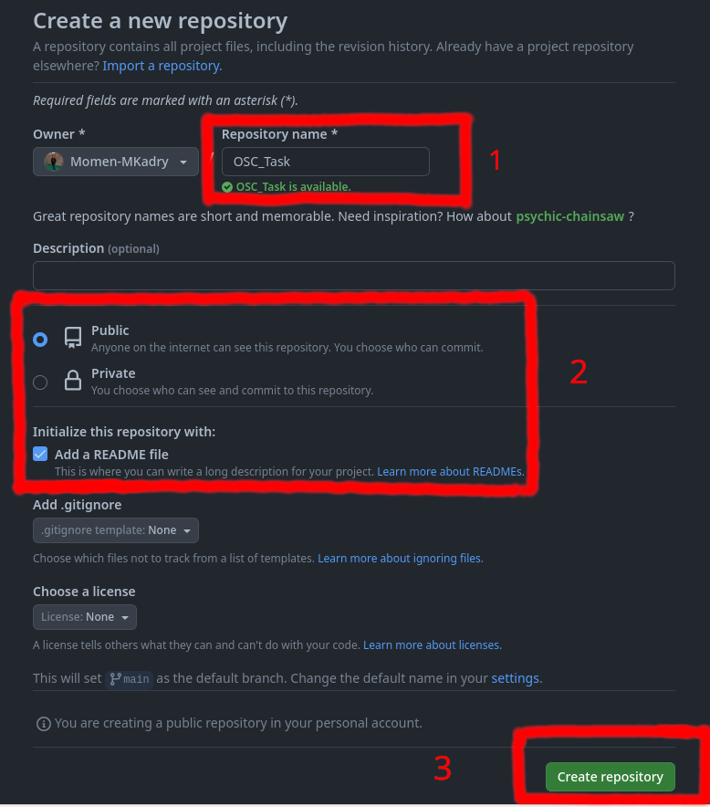
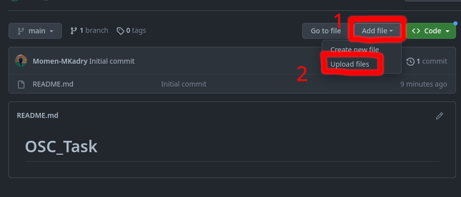
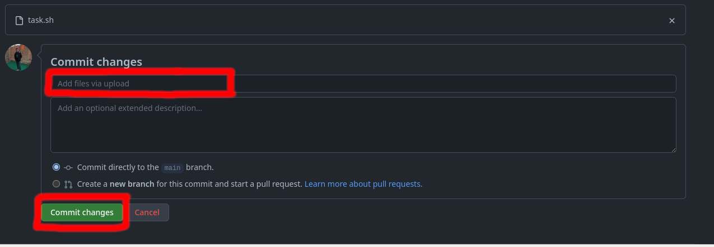

## Steps to create a repo on github:

1. Go to [github.com](https://github.com) and press on `new`

2. Choose a suitable name for your repo, and choose 'Public', then press 'Create repository'.

3. To upload your files you can:
    * Drag and drop the file from the file manager.
    * Upload files
    

4. Write a commit message in the box and then press 'Commit changes'.

