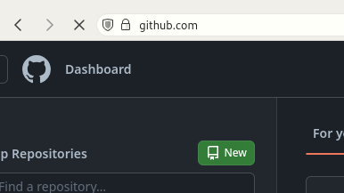

## Sections
[Creating Github account](#creating-github-account)

[Creating a repo](#creating-a-repo-on-github)

[Delivering tasks](#delivering-tasks)

## Creating GitHub account

* First go to [github.com](github.com) and choose 'Sign up'.

* Enter your email.

* Choose a password and username.

* Complete the required steps.

* Check your email for the verification code.

* Complete the required steps.

* Your account is ready now.

---

## Creating a repo on GitHub

1. Go to [github.com](https://github.com) and press on `new`.

---

### 3. Choose a suitable name for your repo, and choose 'Public', then press 'Create repository'.

3. To upload your files you can:
    * Drag and drop the file from the file manager.
    * Upload files.
    

---

## Delivering Tasks

* When delivering tasks go to your repo and press the 'Code' button.

* After that select 'HTTPS' (It should be the default option) and copy the link.

* Take this link and submit it in the task delivery form that will be sent on the Discord server.
